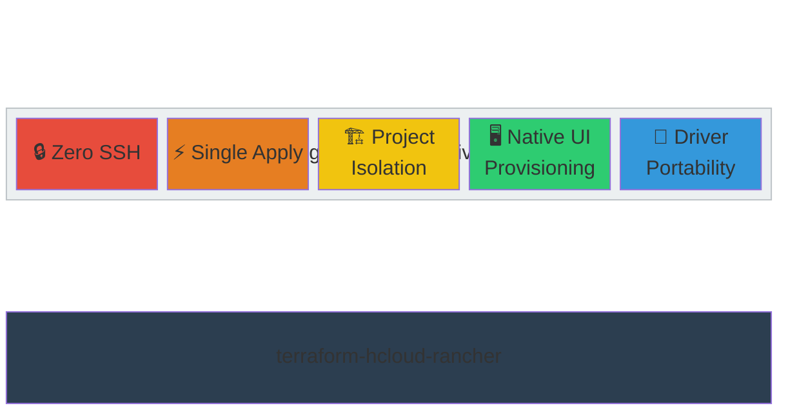
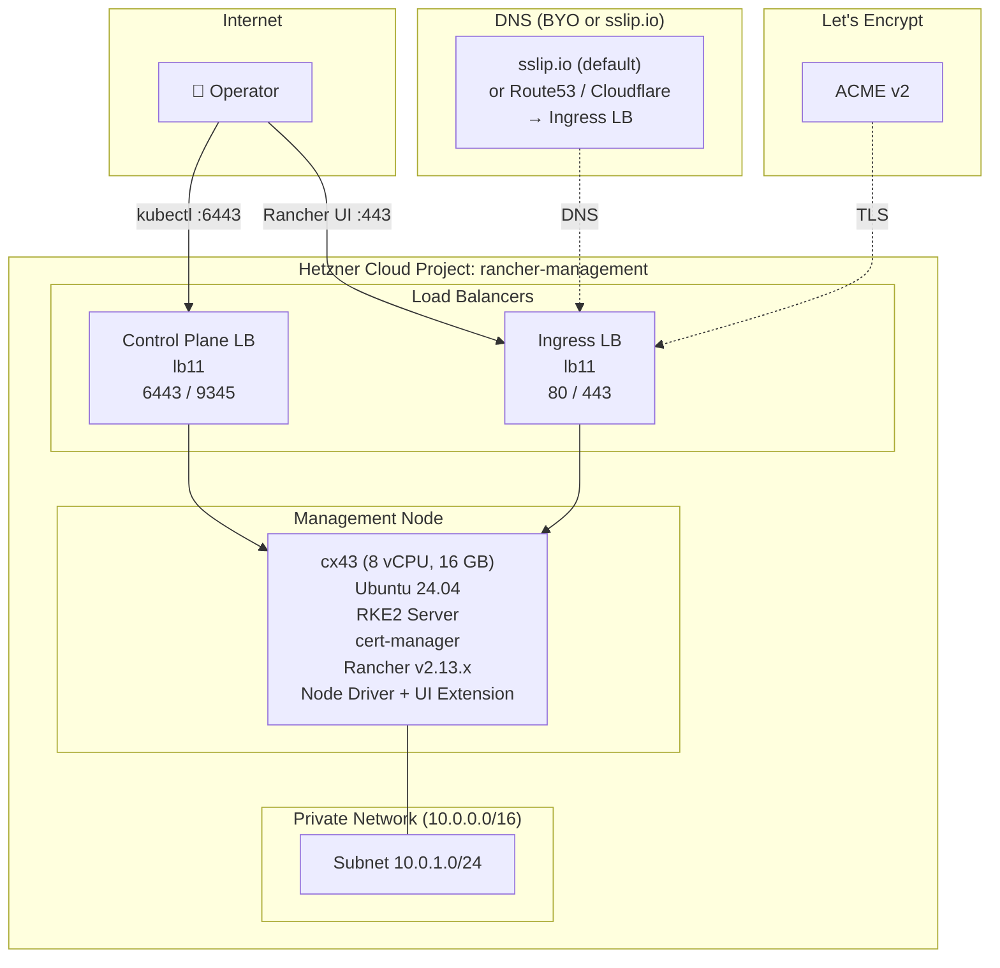
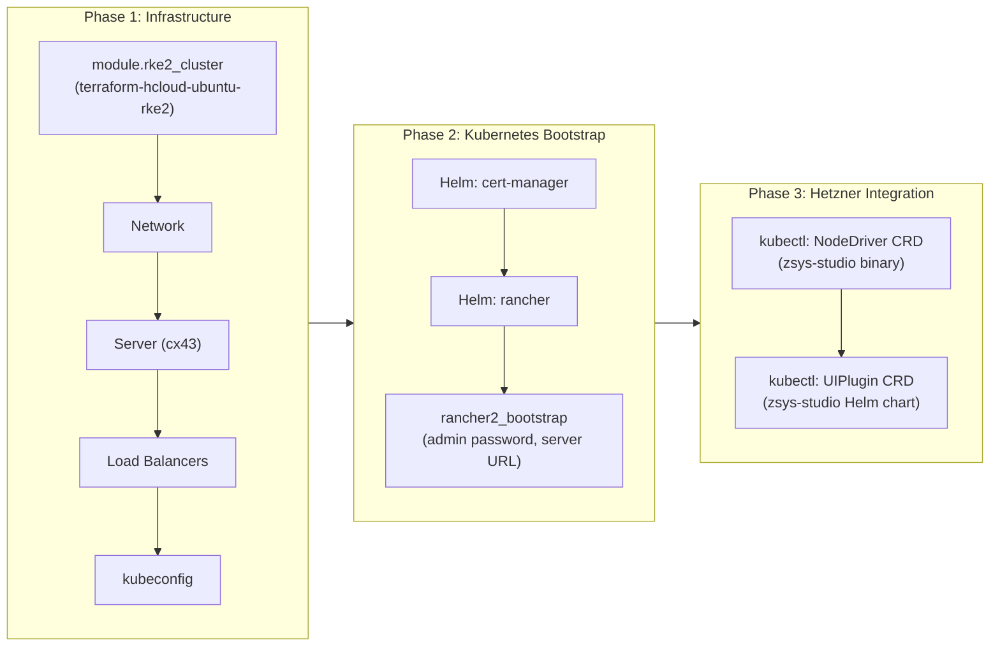
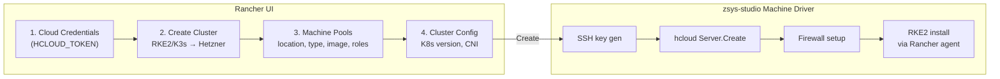
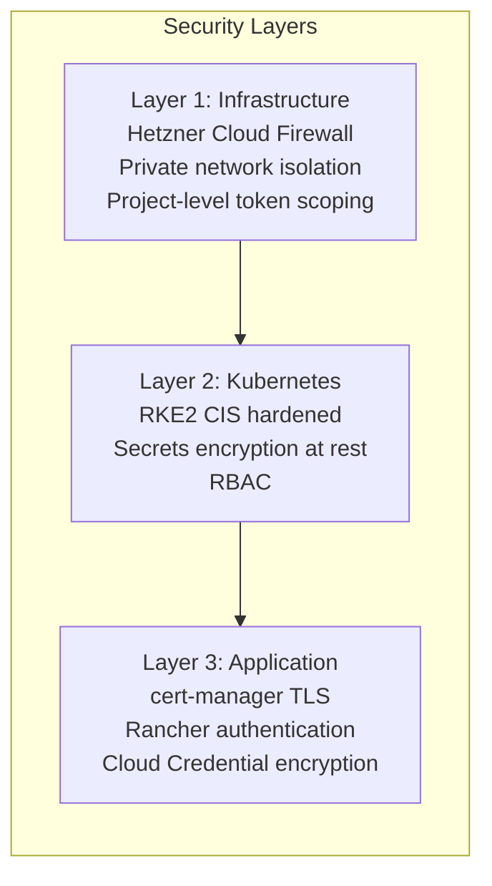
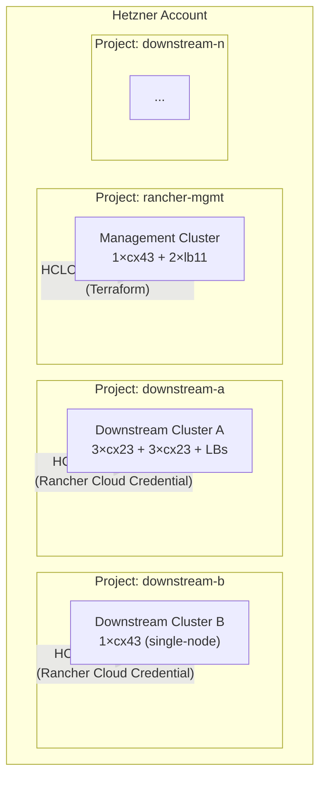

# Architecture Document

> **Module**: `terraform-hcloud-rancher`
> **Status**: **Tested** — first successful deployment completed 2026-02-27
> **Target**: Rancher management cluster on Hetzner Cloud
> **Last updated**: 2026-02-27

---

## Table of Contents

- [Design Philosophy](#design-philosophy)
- [Module Architecture](#module-architecture)
- [Infrastructure Topology](#infrastructure-topology)
- [Deployment Flow](#deployment-flow)
- [Downstream Cluster Provisioning](#downstream-cluster-provisioning)
- [Hetzner Node Driver (zsys-studio)](#hetzner-node-driver-zsys-studio)
- [Security Model](#security-model)
- [Why Rancher](#why-rancher)
- [Hetzner Cloud Project Isolation](#hetzner-cloud-project-isolation)
- [Hardware Sizing](#hardware-sizing)
- [Compromise Log](#compromise-log)
- [Risks and Mitigations](#risks-and-mitigations)
- [Roadmap](#roadmap)
- [Out of Scope](#out-of-scope)

---

## Design Philosophy

This module is guided by five **engineering objectives**. Each is tied to concrete implementation choices and explicit trade-offs.



| Principle | Meaning |
|-----------|---------|
| **Zero SSH** | No SSH keys, no provisioners, no remote-exec. All bootstrapping via cloud-init. Kubeconfig and readiness via Rancher API (HTTPS). |
| **Single Apply** | `tofu apply` produces a fully operational Rancher instance. No manual steps, no Helmfile, no post-apply scripts. |
| **Project Isolation** | Management cluster in a dedicated Hetzner Cloud Project. Downstream clusters in separate projects with separate API tokens. Each token scoped to one project. |
| **Native UI Provisioning** | Downstream clusters created entirely through Rancher UI — operator selects "Hetzner", configures machine pools, clicks Create. No Terraform for downstream. |
| **Driver Portability** | The Hetzner Node Driver (`rancher-hetzner-cluster-provider`) is installed as a CRD — removable, upgradable, replaceable without rebuilding the management cluster. |

### Technology Choices

Each objective maps to specific implementation choices:

| Objective | Implementation |
|-----------|---------------|
| Zero SSH | Cloud-init for RKE2 bootstrap, Rancher API for kubeconfig + readiness, no `remote-exec` provisioners |
| Single Apply | Helm + Kubernetes + rancher2 providers in-module (L4 inside Terraform, not Helmfile) |
| Project Isolation | Separate Hetzner Cloud Projects per downstream cluster, separate `HCLOUD_TOKEN` per project, Rancher Cloud Credential encryption |
| Native UI Provisioning | zsys-studio Machine Driver + Vue 3 UI Extension, NodeDriver CRD, UIPlugin CRD |
| Driver Portability | NodeDriver installed as Kubernetes CRD, UI Extension as UIPlugin CRD — both removable without cluster rebuild |

### Relationship to terraform-hcloud-ubuntu-rke2 Objectives

This module inherits security and operational principles from `terraform-hcloud-ubuntu-rke2` but departs on several points:

| Concern | terraform-hcloud-ubuntu-rke2 | terraform-hcloud-rancher |
|---------|----------------------|-------------------------|
| SSH access | Required (provisioners) | **None** (cloud-init only) |
| Kubeconfig retrieval | SSH cat + jq | **Rancher API** (HTTPS) |
| Cluster readiness | SSH remote-exec polling | **Rancher API** readiness checks |
| Addon management | Helmfile (external, L4) | **Helm provider** (in-module, single apply) |
| K8s providers | Not used | **helm + kubernetes + kubectl** (required for Rancher install) |
| Module type | Reusable infrastructure primitive | Opinionated deployment module |

---

## Module Architecture

The module uses a **two-layer architecture**: L3 infrastructure (delegated to `terraform-hcloud-ubuntu-rke2`) and L4 Kubernetes bootstrap (cert-manager, Rancher, Node Driver). The root module is a **thin shim** that routes variables and configures providers.

```
terraform-hcloud-rancher/                # Root module (shim)
├── main.tf                              # module "rke2", module "rancher"
├── variables.tf                         # All user-facing variables
├── outputs.tf                           # rancher_url, admin_token, kubeconfig
├── providers.tf                         # hcloud, helm, kubernetes, rancher2, ...
├── versions.tf                          # required_providers + terraform version
│
├── modules/
│   ├── rke2-cluster/                    # L3: Wrapper around terraform-hcloud-ubuntu-rke2
│   │   ├── main.tf                      # module "infrastructure" source call
│   │   ├── variables.tf                 # Subset of rke2 vars + management defaults
│   │   ├── outputs.tf                   # kubeconfig, cluster_host, LB IPs
│   │   └── versions.tf                  # required_providers
│   │
│   └── rancher/                         # L4: Rancher installation + bootstrap
│       ├── main.tf                      # cert-manager, rancher helm, bootstrap
│       ├── node-driver.tf               # NodeDriver CRD + UI Extension
│       ├── variables.tf                 # Rancher version, hostname, admin password
│       ├── outputs.tf                   # rancher_url, admin_token
│       └── versions.tf                  # required_providers (helm, kubernetes, rancher2)
│
├── docs/
│   └── ARCHITECTURE.md                  # This document
│
├── examples/
│   ├── minimal/                         # Single-node management cluster
│   └── production/                      # HA management + downstream provisioning
│
└── tests/
    ├── variables.tftest.hcl             # Variable validation tests
    └── README.md                        # Test documentation
```

### Layer Separation

| Layer | Component | Responsibility | Tools |
|:-----:|-----------|----------------|-------|
| L3 | `modules/rke2-cluster/` | Hetzner Cloud infrastructure (servers, network, LB) | OpenTofu via `terraform-hcloud-rke2-core` |
| L4 | `modules/rancher/` | cert-manager + Rancher Helm install + bootstrap + Node Driver | OpenTofu (helm, kubernetes, rancher2 providers) |
| Shim | Root (`/`) | Variable routing, provider config, output wiring | OpenTofu |

### Design Decisions

**L4 in-module (not Helmfile)**: Unlike `terraform-hcloud-ubuntu-rke2` where L4 is external (Helmfile), this module includes L4 inside Terraform. The module must produce a working Rancher from one `tofu apply` — requiring a separate Helmfile step defeats the purpose. The `rancher2_bootstrap` resource requires the Rancher Helm release to be complete, creating a natural dependency chain within a single apply. The chicken-and-egg is solvable here because the RKE2 cluster is created in Phase 1 and its kubeconfig is available for Phase 2 providers.

**Trade-off:** This means the module uses kubernetes/helm/rancher2 providers, which `terraform-hcloud-ubuntu-rke2` deliberately avoids. Acceptable because `terraform-hcloud-rancher` is a deployment module (opinionated), not a reusable infrastructure primitive.

**Root as shim, not orchestrator**: The root module contains no resources directly. It declares providers, defines all user-facing variables, and routes inputs to child modules.

### Provider Flow

```
Root module (provider configuration)
    │
    ├── module.rke2_cluster
    │   └── uses: hcloud, cloudinit, remote, random, tls, local
    │   └── outputs: cluster_host, client_cert, client_key, cluster_ca, ...
    │
    └── module.rancher
        └── uses: helm, kubernetes, kubectl, rancher2
        └── inputs: kubeconfig from module.rke2_cluster
        └── outputs: rancher_url, admin_token
```

Providers are configured **in the root module only**. Child modules declare `required_providers` (source + version) but do **not** contain `provider {}` blocks. Phase 1 providers use static values; Phase 2/3 providers use outputs from Phase 1.

**Two-phase rancher2 provider**: The `rancher2` provider is configured twice — once in `bootstrap` mode (only needs hostname, used for initial admin setup) and once in normal mode (uses token from bootstrap output). This resolves the chicken-and-egg: bootstrap requires Rancher URL before Rancher is fully ready.

**Known limitation:** If `module.rke2_cluster` fails, the helm/kubernetes providers will also fail. The entire deployment fails together — acceptable for a single-apply module.

---

## Infrastructure Topology



### Default Management Topology

| Component | Spec | Notes |
|-----------|------|-------|
| Nodes | 1 × cx43 (8 vCPU, 16 GB) | Rancher minimum for ≤5 downstream clusters |
| LB (control plane) | lb11 | Ports 6443, 9345 |
| LB (ingress) | lb11 | Ports 80, 443 — Rancher UI |
| Network | 10.0.0.0/16 | Private subnet |
| DNS | Operator-managed | Point A-record for `rancher_hostname` → `ingress_lb_ipv4` output |
| OS | Ubuntu 24.04 LTS | Same as downstream clusters |
| K8s | RKE2 v1.34.x | Matches Rancher v2.13 default |

**Why single node?** The management cluster runs only Rancher and its dependencies. For HA, scale to 3 nodes. The module supports `control_plane_count = 1 | 3`.

---

## Deployment Flow



### Phase 1: Infrastructure (terraform-hcloud-ubuntu-rke2)

1. **Network** — private network `10.0.0.0/16` with subnet `10.0.1.0/24`
2. **SSH key** — auto-generated ED25519 key pair (optional, BYO SSH)
3. **Load balancers** — control-plane LB + ingress LB
4. **Management node** — single cx43 server, RKE2 via cloud-init
5. **kubeconfig** — fetched after cluster is ready

```hcl
module "rke2_cluster" {
  source = "git::https://github.com/mbilan1/terraform-hcloud-ubuntu-rke2.git"

  cluster_name              = var.cluster_name
  hcloud_token              = var.hcloud_token
  control_plane_count       = var.management_node_count  # 1 (dev) or 3 (HA)
  agent_node_count          = 0                          # No workers — Rancher on control plane
  control_plane_server_type = "cx43"                     # 8 vCPU, 16 GB minimum
  harmony_enabled           = false                      # Not needed for management
}
```

Outputs: `kubeconfig`, `cluster_host`, `cluster_ca_certificate`, `control_plane_lb_ipv4`.

### Phase 2: Kubernetes Bootstrap

7. **cert-manager** — Helm release (required by Rancher for TLS)
8. **Rancher** — Helm release with Let's Encrypt TLS
9. **rancher2_bootstrap** — waits for Rancher readiness, sets admin password + server URL

```hcl
resource "helm_release" "cert_manager" {
  name             = "cert-manager"
  repository       = "https://charts.jetstack.io"
  chart            = "cert-manager"
  namespace        = "cert-manager"
  create_namespace = true
  version          = var.cert_manager_version  # ~> 1.17

  set {
    name  = "crds.enabled"
    value = "true"
  }
}

resource "helm_release" "rancher" {
  name             = "rancher"
  repository       = "https://releases.rancher.com/server-charts/stable"
  chart            = "rancher"
  namespace        = "cattle-system"
  create_namespace = true
  version          = var.rancher_version  # ~> 2.13

  set { name = "hostname";           value = var.rancher_hostname }
  set { name = "bootstrapPassword";  value = var.admin_password }
  set { name = "ingress.tls.source"; value = "letsEncrypt" }
  set { name = "letsEncrypt.email";  value = var.letsencrypt_email }

  depends_on = [helm_release.cert_manager]
}

resource "rancher2_bootstrap" "admin" {
  provider  = rancher2.bootstrap
  password  = var.admin_password
  telemetry = false
  depends_on = [helm_release.rancher]
}
```

### Phase 3: Hetzner Integration

10. **NodeDriver CRD** — registers zsys-studio binary as a Rancher node driver
11. **UIPlugin CRD** — installs Hetzner UI extension for Rancher dashboard

```hcl
# DECISION: Install NodeDriver via kubectl_manifest, not rancher2_node_driver
# Why: rancher2_node_driver resource doesn't support all required fields
#      (whitelistDomains, addCloudCredential). Raw manifest is more precise.

resource "kubectl_manifest" "hetzner_node_driver" {
  yaml_body = yamlencode({
    apiVersion = "management.cattle.io/v3"
    kind       = "NodeDriver"
    metadata = {
      name        = "hetzner"
      annotations = { "privateCredentialFields" = "apiToken" }
    }
    spec = {
      active             = true
      addCloudCredential = true
      displayName        = "Hetzner"
      url                = "https://github.com/zsys-studio/rancher-hetzner-cluster-provider/releases/download/v${var.hetzner_driver_version}/docker-machine-driver-hetzner_${var.hetzner_driver_version}_linux_amd64.tar.gz"
      whitelistDomains   = ["api.hetzner.cloud"]
    }
  })
  depends_on = [rancher2_bootstrap.admin]
}

resource "kubectl_manifest" "hetzner_ui_extension" {
  yaml_body = yamlencode({
    apiVersion = "catalog.cattle.io/v1"
    kind       = "UIPlugin"
    metadata = {
      name      = "hetzner-node-driver"
      namespace = "cattle-ui-plugin-system"
    }
    spec = {
      plugin = {
        name     = "hetzner-node-driver"
        version  = var.hetzner_driver_version
        endpoint = "https://github.com/zsys-studio/rancher-hetzner-cluster-provider/releases/download/v${var.hetzner_driver_version}/hetzner-node-driver-${var.hetzner_driver_version}.tgz"
        noCache  = false
        noAuth   = true
      }
    }
  })
  depends_on = [rancher2_bootstrap.admin]
}
```

---

## Downstream Cluster Provisioning

After `tofu apply` completes, downstream clusters are created **through Rancher UI** (not Terraform):



### Workflow

1. **Cloud Credentials** → Create → Hetzner Cloud → enter the project's `HCLOUD_TOKEN`
2. **Cluster Management** → Create → "Provision new nodes using RKE2/K3s" → Hetzner
3. **Machine Pools** → configure per pool:
   - Location: `hel1`, `nbg1`, `fsn1`
   - Server Type: `cx23`, `cx33`, `cx43`, ...
   - Image: `ubuntu-24.04`
   - Roles: etcd, control-plane, worker (mix or dedicated)
   - Count: 1-N
4. **Cluster Config** → Kubernetes version, CNI, cloud provider, etc.
5. **Create** → Rancher provisions servers via Hetzner API, installs RKE2

### Post-Provisioning (per downstream cluster)

After cluster creation, install Hetzner cloud integrations:

```bash
# Hetzner Cloud Controller Manager
helm install hcloud-ccm hcloud/hcloud-cloud-controller-manager \
  --namespace kube-system \
  --set env.HCLOUD_TOKEN=<project-token>

# Hetzner CSI Driver
helm install hcloud-csi hcloud/hcloud-csi-driver \
  --namespace kube-system \
  --set env.HCLOUD_TOKEN=<project-token>
```

> **TODO:** Investigate automating CCM/CSI installation via Rancher's `cluster-template` or `fleet` for new downstream clusters.

---

## Hetzner Node Driver (zsys-studio)

### Source

| Property | Value |
|----------|-------|
| Repository | [zsys-studio/rancher-hetzner-cluster-provider](https://github.com/zsys-studio/rancher-hetzner-cluster-provider) |
| Version | v0.8.0 (Feb 2026) |
| License | Apache-2.0 |
| Language | Go 88.7%, Vue 7.8% |
| Dependencies | `hcloud-go/v2 v2.36.0`, `rancher/machine v0.15.0-rancher134` |
| Requires | Rancher v2.11+ |
| Platforms | linux/amd64, linux/arm64 |

### Components

**Machine Driver** (`driver/`) — Go binary implementing `rancher/machine` Driver interface:
- `Create()` — generates SSH key, creates hcloud server, sets up firewall
- `Remove()` — removes node IP from firewall, deletes server + SSH key + orphan firewall
- `Start()`, `Stop()`, `Restart()`, `Kill()` — server power management
- `GetState()` — maps hcloud server status to Docker Machine state
- `PreCreateCheck()` — validates token, server type, location, image (arch-aware)

**UI Extension** (`extension/`) — Vue 3 Rancher extension (Extensions API v3):
- `cloud-credential/` — Hetzner API Token input form
- `machine-config/` — Machine pool configuration (dropdowns for server type, location, image)
- `store/` — Vue state for Hetzner API data fetching
- `l10n/` — Internationalization

### Firewall Management

The driver manages a **shared cluster firewall** automatically:

| Feature | Behavior |
|---------|----------|
| First node | Creates firewall with RKE2 rules + first node's IP |
| Joining nodes | Finds firewall by label, adds own IP /32 to internal rules |
| Concurrent safety | Read-modify-verify with exponential backoff (100ms–5s) + ±25% jitter |
| Node removal | Removes node's IP from firewall rules |
| Last node | Deletes the firewall |
| Race handling | `uniqueness_error` on concurrent create → falls back to find |

### Quality Assessment

| Criterion | Assessment |
|-----------|-----------|
| Code quality | Proper error wrapping, context timeouts, cleanup on failure |
| Test coverage | 2.2:1 test/code ratio (3811 lines tests, 1713 lines code) |
| Dependencies | Current — hcloud-go v2.36.0, rancher/machine v0.15.0-rancher134 |
| CI/CD | GoReleaser + GitHub Actions, checksums |
| Bus factor | 1 primary author — small project, code is well-structured and forkable if needed |
| Maturity | v0.8.0, not v1.0 yet |

---

## Security Model



### Principles

- **Defense in depth** — no single layer is sufficient; compromise at one layer must not cascade
- **Least privilege** — each Hetzner Cloud token scoped to exactly one project
- **Zero trust between projects** — downstream clusters cannot reach management infrastructure
- **Encryption everywhere** — TLS for all external traffic, encrypted etcd secrets

### Layer 1: Infrastructure

| Control | Implementation | Status |
|---------|---------------|--------|
| Cloud Firewall | Hetzner Cloud Firewall (BYO — consumer creates and passes IDs) | ✅ Via `firewall_ids` variable (ADR-006) |
| Private network | Inter-node traffic on 10.0.0.0/16 | ✅ Via terraform-hcloud-ubuntu-rke2 |
| Project isolation | Separate Hetzner Cloud Project per downstream cluster | ✅ Design-level |
| No SSH | Cloud-init only bootstrap, no SSH provisioners | ✅ Implemented |
| Egress filtering | Not implemented — all outbound traffic allowed | 🔲 Not implemented |

### Layer 2: Kubernetes

| Control | Implementation | Status |
|---------|---------------|--------|
| Secrets encryption at rest | RKE2 `secrets-encryption: true` | ✅ Via terraform-hcloud-ubuntu-rke2 |
| RBAC | Kubernetes native RBAC | ✅ Built-in (RKE2) |
| Network Policies | Default deny + explicit allow | 🔲 Planned |
| Pod Security Standards | Admission controller | 🔲 Planned |
| etcd backup | S3-compatible backup for management etcd | 🟡 Via terraform-hcloud-ubuntu-rke2 (opt-in) |

### Layer 3: Application

| Control | Implementation | Status |
|---------|---------------|--------|
| TLS | Let's Encrypt via cert-manager | ✅ Implemented |
| Rancher auth | Local admin + optional SAML/OIDC | 🟡 Partial (OIDC is post-deploy) |
| Cloud Credential encryption | Rancher encrypts credentials in etcd | ✅ Built-in (Rancher) |
| Audit logging | Rancher audit log | 🔲 Planned |

### Known Gaps

| Gap | Severity | Mitigation |
|-----|----------|------------|
| Rancher admin password in Terraform state | Medium | Mark as sensitive, use remote state with encryption |
| No network policies on management cluster | Medium | Add post-deploy |
| zsys-studio driver SSH keys persist in Hetzner | Low | Auto-generated, manageable via Rancher |
| No audit logging on management cluster | Medium | Enable Rancher audit log post-deploy |

---

## Why Rancher

[Rancher](https://www.rancher.com/) was chosen as the multi-cluster management layer for the following reasons:

1. **Native multi-cluster management** — Rancher provides a single pane of glass for managing multiple downstream Kubernetes clusters. Cluster creation, monitoring, RBAC, and upgrades are handled through one UI.

2. **Node Driver extensibility** — Rancher supports custom Machine Drivers for any cloud provider. The [zsys-studio/rancher-hetzner-cluster-provider](https://github.com/zsys-studio/rancher-hetzner-cluster-provider) adds Hetzner as a first-class provisioning target with full UI integration.

3. **RKE2 integration** — Rancher and RKE2 are both SUSE/Rancher projects. Rancher natively provisions and manages RKE2 clusters without additional adapters or CRDs (unlike CAPI/CAPH which requires Turtles + kubeadm).

4. **Terraform provider** — the `rancher/rancher2` Terraform provider enables automated bootstrap (admin password, server URL, telemetry settings) within the same `tofu apply` that creates the cluster.

5. **Fleet built-in** — Rancher includes Fleet for GitOps-based application deployment across downstream clusters. This provides a path to automated CCM/CSI installation on new clusters.

### Alternatives Considered

| Alternative | Why rejected |
|-------------|-------------|
| CAPI/CAPH | Uses kubeadm (not RKE2), requires Rancher Turtles adapter, heavy stack |
| Direct `rancher2` provider (no Node Driver) | `machine_config_v2` has no Hetzner support — only amazonec2, azure, digitalocean, harvester, linode, openstack, vsphere, google |
| Manual cluster management | Does not scale beyond a few clusters, no centralized RBAC or monitoring |

---

## Hetzner Cloud Project Isolation

### Architecture



### Token Flow

| Token | Stored In | Used By | Access |
|-------|-----------|---------|--------|
| `HCLOUD_TOKEN_MGMT` | Terraform state + Rancher secret | terraform-hcloud-ubuntu-rke2 module, Hetzner CCM on mgmt | Management project only |
| `HCLOUD_TOKEN_A` | Rancher Cloud Credential (encrypted) | zsys-studio Node Driver | Downstream project A only |
| `HCLOUD_TOKEN_B` | Rancher Cloud Credential (encrypted) | zsys-studio Node Driver | Downstream project B only |

### Isolation Properties

- Each API token scopes to exactly one Hetzner Cloud Project
- Compromised downstream token cannot access management infrastructure
- Compromised downstream token cannot access other downstream projects
- Rancher stores Cloud Credentials encrypted in its etcd

---

## Hardware Sizing

### Management Cluster

| Scenario | Nodes | Server Type | RAM | Downstream Limit |
|----------|-------|-------------|-----|------------------|
| Dev/Test | 1 | cx43 | 16 GB | ≤5 clusters, ≤50 nodes |
| HA | 3 | cx43 | 16 GB each | ≤150 clusters, ≤1500 nodes |

Source: [Rancher installation requirements](https://ranchermanager.docs.rancher.com/getting-started/installation-and-upgrade/installation-requirements)

### Downstream Clusters (typical, per cluster)

| Workload | Masters | Workers | Master Type | Worker Type |
|----------|---------|---------|-------------|-------------|
| Small | 1 | 2 | cx23 | cx33 |
| Medium | 3 | 3 | cx23 | cx43 |
| Minimal | 1 | 0 | cx23 | — |

---

## Compromise Log

The module contains deliberate compromises. Each is documented in code comments at the point of implementation.

| # | Decision | Compromise | Rationale |
|---|----------|-----------|-----------|
| 1 | K8s providers in module | Composability vs single-apply | Rancher install requires helm/kubernetes providers in the same module. Acceptable for a deployment module (not a reusable primitive). |
| 2 | Single management node default | HA vs resource usage | Management cluster runs only Rancher. HA (3 nodes) is for production, not default. |
| 3 | zsys-studio driver (v0.8.0) | Stability vs functionality | Bus factor = 1. Code is well-tested (2.2:1 test ratio) and forkable if needed. |
| 4 | NodeDriver via raw manifest | Provider support vs control | `rancher2_node_driver` resource exists but may not support all fields (whitelistDomains, addCloudCredential annotations). Raw manifest gives full control. |
| 5 | UI Extension via UIPlugin CRD | Automation vs manual | Alternative: operator adds git repo manually in UI. CRD approach is fully automated. |
| 6 | No automated CCM/CSI on downstream | Automation vs scope | Post-cluster HCCM/CSI install is manual per downstream cluster. Automating via Fleet/cluster-template is a roadmap item. |
| 7 | Cloud-init kubeconfig retrieval | Zero SSH vs data.external | terraform-hcloud-ubuntu-rke2 uses SSH for kubeconfig internally. This module consumes the output but adds no SSH of its own. |

---

## Risks and Mitigations

| Risk | Probability | Impact | Mitigation |
|------|------------|--------|------------|
| zsys-studio driver abandoned | Medium | High | Code is well-structured, testable, and 1713 LOC — forkable and maintainable if needed. |
| Rancher v2.14 breaks Extensions API | Low | Medium | zsys-studio requires v2.11+. Extensions API v3 is stable. Pin Rancher version. |
| Provider version conflicts (rke2 module vs rancher module) | Medium | Medium | Pin terraform-hcloud-ubuntu-rke2 to a git tag. Both use hcloud provider — version must match. |
| Management cluster failure | Low | Critical | Downstream clusters continue running without Rancher. Only management operations (scale, upgrade, new clusters) are affected. HA for production. |
| Hetzner API rate limiting | Low | Low | zsys-studio driver uses exponential backoff. Stagger cluster creation. |

---

## Roadmap

### Near-term (MVP)

- [x] Create module structure (main.tf, variables.tf, outputs.tf, providers.tf)
- [x] Integrate terraform-hcloud-ubuntu-rke2 as management cluster source
- [x] cert-manager + Rancher Helm installation
- [x] rancher2_bootstrap (admin password, server URL)
- [x] Hetzner NodeDriver CRD installation
- [x] UI Extension installation
- [x] DNS (operator A-record: `ingress_lb_ipv4` output)
- [x] examples/minimal/ — single-node management cluster
- [x] ARCHITECTURE.md (this document)
- [ ] AGENTS.md

### Mid-term (hardening)

- [ ] HA management cluster (3 nodes)
- [ ] BYO firewall example for management cluster (ADR-006)
- [ ] Rancher backup/restore configuration
- [ ] Monitoring stack on management cluster
- [ ] tests/ — variable validation, guardrails
- [ ] CI pipeline (lint, validate, test)

### Long-term (automation + maturity)

- [ ] Fleet/cluster-template for automated HCCM/CSI on downstream clusters
- [ ] Rancher Cloud Credential management via Terraform (rancher2_cloud_credential)
- [ ] Cluster template with Hetzner defaults (server types, locations, firewall)
- [ ] Automated downstream cluster creation via Terraform (optional)
- [ ] Rancher SAML/OIDC integration template
- [ ] Network policies on management cluster
- [ ] Audit logging configuration

---

## Out of Scope

| Topic | Reason |
|-------|--------|
| **Downstream cluster creation via Terraform** | Downstream clusters are provisioned through Rancher UI. Terraform automation is a long-term roadmap item, not core functionality. |
| **Application deployment on downstream** | This module deploys management infrastructure only. Application deployment is a separate concern. |
| **Multi-cloud downstream clusters** | This module supports Hetzner-only downstream clusters via the zsys-studio driver. Other cloud providers use Rancher's built-in drivers. |
| **Custom Node Driver development** | The zsys-studio driver is used as-is. Custom driver development is out of scope. |
| **Rancher Fleet/GitOps configuration** | Fleet is Rancher's built-in GitOps engine. Configuring it is an operational concern, not a module concern. |
| **Backup/DR strategy** | The module enables Rancher backup infrastructure. The strategy (frequency, retention, testing) is the operator's responsibility. |
