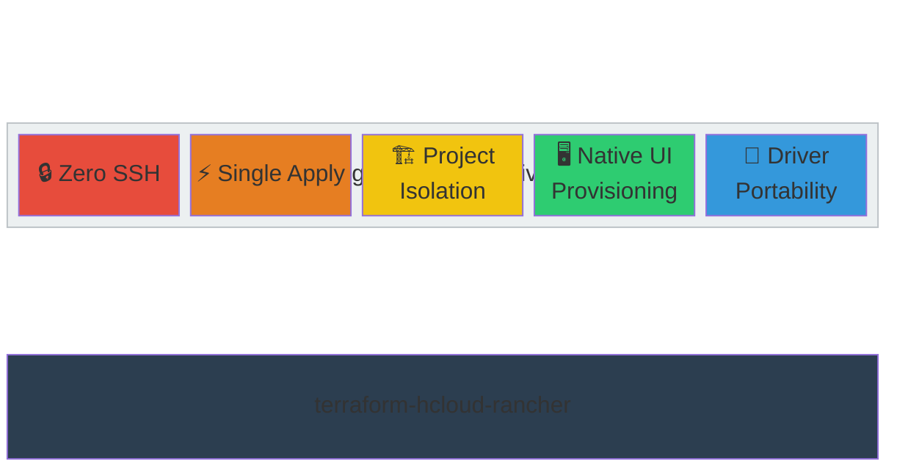
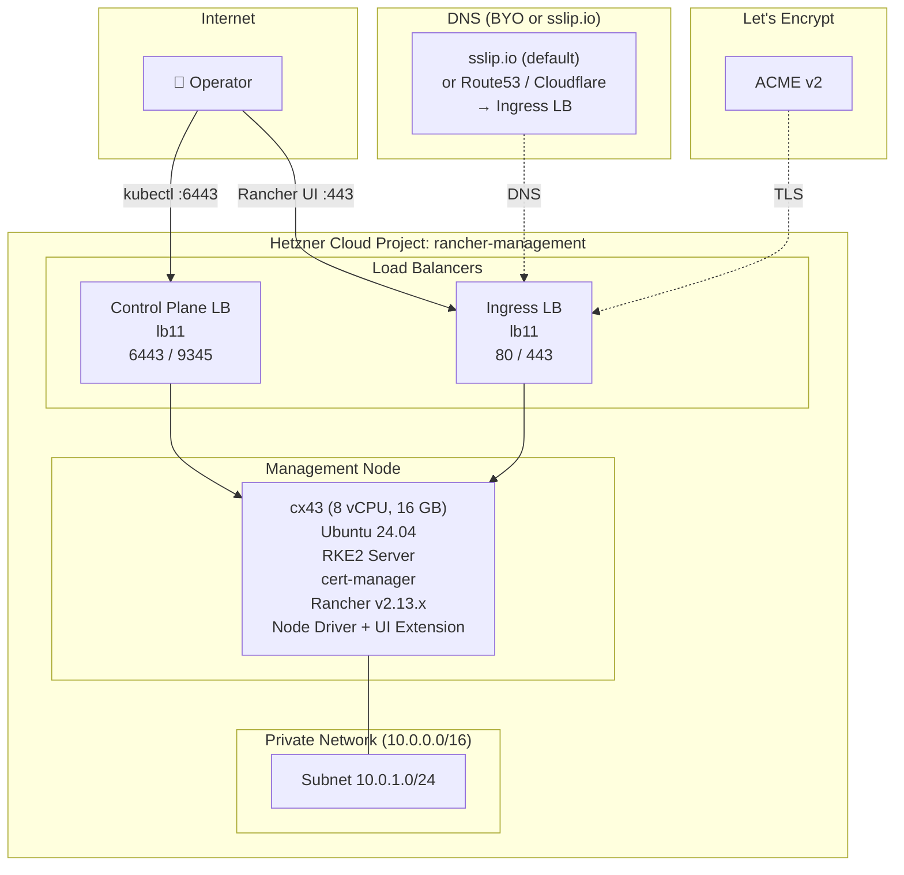
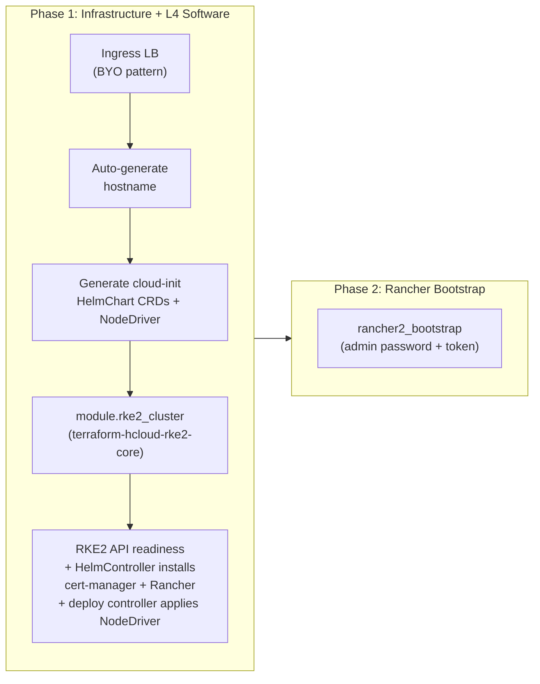
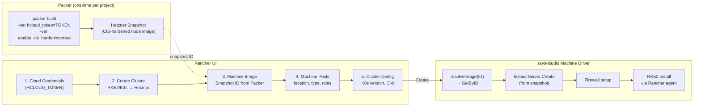
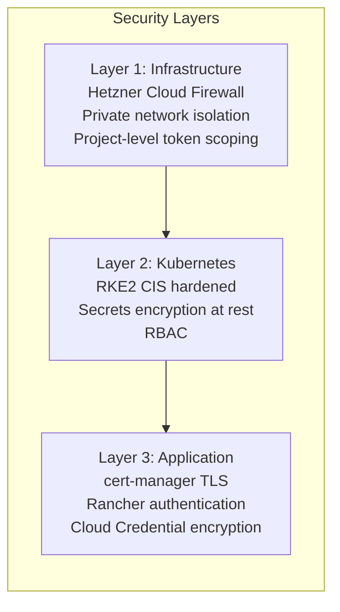
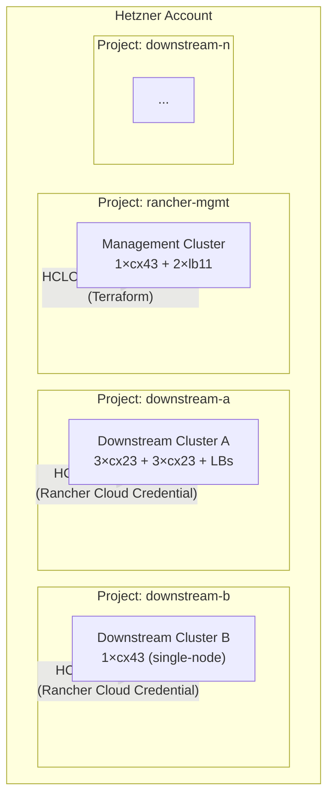

# Architecture Document

> **Module**: `terraform-hcloud-rancher`
> **Status**: **Tested** — first successful deployment completed 2026-02-27
> **Target**: Rancher management cluster on Hetzner Cloud
> **Last updated**: 2026-03-05

---

## Table of Contents

- [Design Philosophy](#design-philosophy)
- [Module Architecture](#module-architecture)
- [Infrastructure Topology](#infrastructure-topology)
- [Deployment Flow](#deployment-flow)
- [Downstream Cluster Provisioning](#downstream-cluster-provisioning)
- [Hetzner Node Driver (zsys-studio)](#hetzner-node-driver-zsys-studio)
- [Security Model](#security-model)
- [Why Rancher](#why-rancher)
- [Hetzner Cloud Project Isolation](#hetzner-cloud-project-isolation)
- [Hardware Sizing](#hardware-sizing)
- [Compromise Log](#compromise-log)
- [Risks and Mitigations](#risks-and-mitigations)
- [Roadmap](#roadmap)
- [Out of Scope](#out-of-scope)

---

## Design Philosophy

This module is guided by five **engineering objectives**. Each is tied to concrete implementation choices and explicit trade-offs.



| Principle | Meaning |
|-----------|---------|
| **Zero SSH** | No SSH keys, no provisioners, no remote-exec. All bootstrapping via cloud-init. Kubeconfig and readiness via Rancher API (HTTPS). |
| **Single Apply** | `tofu apply` produces a fully operational Rancher instance. No manual steps, no Helmfile, no post-apply scripts. |
| **Project Isolation** | Management cluster in a dedicated Hetzner Cloud Project. Downstream clusters in separate projects with separate API tokens. Each token scoped to one project. |
| **Native UI Provisioning** | Downstream clusters created entirely through Rancher UI — operator selects "Hetzner", configures machine pools, clicks Create. No Terraform for downstream. |
| **Driver Portability** | The Hetzner Node Driver (`rancher-hetzner-cluster-provider`) is installed as a CRD — removable, upgradable, replaceable without rebuilding the management cluster. |

### Technology Choices

Each objective maps to specific implementation choices:

| Objective | Implementation |
|-----------|---------------|
| Zero SSH | Cloud-init for RKE2 bootstrap + L4 manifests, no SSH provisioners, no kubeconfig output |
| Single Apply | Cloud-init HelmChart CRDs + cloud-init NodeDriver manifest + `rancher2_bootstrap` (2 providers only: `hcloud` + `rancher2`) |
| Project Isolation | Separate Hetzner Cloud Projects per downstream cluster, separate `HCLOUD_TOKEN` per project, Rancher Cloud Credential encryption |
| Native UI Provisioning | zsys-studio Machine Driver + Vue 3 UI Extension via cloud-init NodeDriver manifest (`spec.uiUrl`) |
| Driver Portability | NodeDriver registered via cloud-init manifest — removable, upgradable without cluster rebuild |

### Relationship to terraform-hcloud-rke2-core

This module builds on `terraform-hcloud-rke2-core` (composable primitive, True Zero-SSH):

| Concern | terraform-hcloud-rke2-core | terraform-hcloud-rancher |
|---------|----------------------|-------------------------|
| SSH access | **None** (True Zero-SSH, ADR-002) | **None** (inherited) |
| Kubeconfig retrieval | Not output (by design) | **Rancher API** (via `rancher2_bootstrap`) |
| Cluster readiness | `curl` health check (local-exec) | Inherited + `rancher2` provider polling |
| Addon management | `extra_server_manifests` (cloud-init) | Cloud-init HelmChart CRDs (cert-manager, Rancher) |
| K8s providers | None | **None** — only `hcloud` + `rancher2` |
| Module type | Reusable infrastructure primitive | Opinionated deployment module |

---

## Module Architecture

The module uses a **two-layer architecture**: L3 infrastructure (delegated to `terraform-hcloud-rke2-core`) and L4 bootstrap (Rancher admin setup). All L4 **software** (cert-manager, Rancher Helm chart, Hetzner Node Driver) is deployed via RKE2 cloud-init manifests.

```
terraform-hcloud-rancher/                # Root module (facade)
├── main.tf                              # BYO LB + cloud-init manifests + module calls
├── variables.tf                         # All user-facing variables
├── outputs.tf                           # rancher_url, admin_token, network_id
├── providers.tf                         # hcloud + rancher2 (2 providers only)
├── versions.tf                          # required_providers + terraform version
├── guardrails.tf                        # Preflight check {} blocks
├── moved.tf                             # State migration (singleton → for_each)
│
├── modules/
│   ├── rke2-cluster/                    # L3: Wrapper around terraform-hcloud-rke2-core
│   │   ├── main.tf                      # module "cluster" source call
│   │   ├── variables.tf                 # Subset of rke2-core vars + management defaults
│   │   ├── outputs.tf                   # network_id, initial_master_ipv4, cluster_ready
│   │   └── versions.tf                  # required_providers
│   │
│   └── rancher/                         # L4: Rancher admin bootstrap
│       ├── main.tf                      # rancher2_bootstrap
│       ├── variables.tf                 # rancher_hostname, admin_password
│       ├── outputs.tf                   # admin_token
│       └── versions.tf                  # required_providers (rancher2 only)
│
├── docs/
│   └── ARCHITECTURE.md                  # This document
│
├── examples/
│   └── minimal/                         # Single-node management cluster
│
└── tests/
    ├── variables.tftest.hcl             # Variable validation tests
    ├── guardrails.tftest.hcl            # Cross-variable guardrail tests
    └── README.md                        # Test documentation
```

### Layer Separation

| Layer | Component | Responsibility | Tools |
|:-----:|-----------|----------------|-------|
| L3 | `modules/rke2-cluster/` | Hetzner Cloud infrastructure (servers, network) | OpenTofu via `terraform-hcloud-rke2-core` |
| L3 | Root (`/`) ingress LB | BYO ingress load balancer (ADR-003) | OpenTofu (`hcloud` provider) |
| L4 | Root (`/`) cloud-init manifests | cert-manager + Rancher HelmChart CRDs + Hetzner Node Driver | RKE2 HelmController + deploy controller (via `extra_server_manifests`) |
| L4 | `modules/rancher/` | Rancher admin bootstrap | OpenTofu (`rancher2` provider, bootstrap mode) |

### Design Decisions

**L4 via cloud-init (not Helm provider)**: cert-manager and Rancher are deployed as RKE2 HelmChart CRDs placed in `/var/lib/rancher/rke2/server/manifests/` via cloud-init. This eliminates the need for `helm`, `kubernetes`, and `kubectl` Terraform providers entirely — rke2-core is True Zero-SSH and does not output kubeconfig, so those providers cannot authenticate.

**NodeDriver via cloud-init manifest (not rancher2_node_driver)**: The NodeDriver CRD is deployed as a raw Kubernetes manifest via cloud-init (`02-hetzner-node-driver.yaml`). The `rancher2_node_driver` Terraform resource was abandoned because it auto-generates `metadata.name` as `nd-XXXXX`, but Rancher's provisioning controller derives the expected driver name from `machineConfigRef.kind` (`HetznerConfig` → `hetzner`) and looks up `nodedrivers.management.cattle.io` by `metadata.name`. The name mismatch causes downstream provisioning to fail with `"hetzner" not found`. The cloud-init manifest gives explicit control over `metadata.name: "hetzner"`. RKE2's deploy controller retries failed manifests until the `management.cattle.io` CRDs are registered by Rancher (~2-3 min after boot).

**Root as facade, not shim**: The root module contains the ingress LB resources directly (inline, not in a submodule) and generates all cloud-init manifest content. This is necessary because the LB IP is needed for hostname auto-generation before `rke2_cluster` runs.

### Provider Flow

```
Root module (2 providers only)
    │
    ├── provider "hcloud"  (token = var.hcloud_api_token)
    │   ├── hcloud_load_balancer.ingress        # BYO ingress LB
    │   ├── hcloud_load_balancer_network/target/service
    │   └── module.rke2_cluster
    │       └── module.cluster (rke2-core)       # servers, network, readiness
    │
    └── provider "rancher2" (bootstrap mode, insecure, timeout = "6m")
        └── module.rancher
            └── rancher2_bootstrap.admin          # admin password + token
```

Providers are configured **in the root module only**. The `rancher2` provider runs in bootstrap mode — it only needs the Rancher URL (auto-generated from LB IP), no auth token. It polls until Rancher is ready, then sets the admin password.

**Known limitation:** If `module.rke2_cluster` fails or Rancher doesn't start within the timeout, the `rancher2` provider will fail. The entire deployment fails together — acceptable for a single-apply module.

---

## Infrastructure Topology



### Default Management Topology

| Component | Spec | Notes |
|-----------|------|-------|
| Nodes | 1 × cx43 (8 vCPU, 16 GB) | Rancher minimum for ≤5 downstream clusters |
| LB (control plane) | lb11 | Ports 6443, 9345 — managed by rke2-core |
| LB (ingress) | lb11 | Ports 80, 443 — Rancher UI (BYO pattern, managed in root `main.tf`) |
| Network | 10.0.0.0/16 | Private subnet |
| DNS | BYO or sslip.io | Auto-generates hostname from ingress LB IP; or set `rancher_hostname` |
| OS | Ubuntu 24.04 LTS | Same as downstream clusters |
| K8s | RKE2 v1.34.4+rke2r1 | Matches Rancher v2.13 compatibility |

**Why single node?** The management cluster runs only Rancher and its dependencies. For HA, scale to 3 nodes. The module supports `management_node_count = 1 | 3`.

---

## Deployment Flow



### Phase 1: Infrastructure + L4 Software

1. **Ingress LB** — created inline in root `main.tf` (BYO pattern with `for_each` gating)
2. **Hostname** — auto-generated from ingress LB IP via sslip.io (or user-provided FQDN)
3. **Cloud-init manifests** — cert-manager + Rancher HelmChart CRDs + Hetzner NodeDriver CRD generated in root `main.tf`
4. **RKE2 cluster** — network, server, cloud-init deployment via `terraform-hcloud-rke2-core`
5. **Readiness** — RKE2 API health check; HelmController installs cert-manager + Rancher; deploy controller applies NodeDriver manifest (retries until Rancher CRDs available)

```hcl
# Cloud-init HelmChart CRDs (generated in root main.tf, passed to rke2-core)
locals {
  rancher_server_manifests = merge(
    {
      "00-cert-manager.yaml" = <<-YAML
        apiVersion: helm.cattle.io/v1
        kind: HelmChart
        metadata:
          name: cert-manager
          namespace: kube-system
        spec:
          repo: https://charts.jetstack.io
          chart: cert-manager
          version: "${var.cert_manager_version}"
          targetNamespace: cert-manager
          createNamespace: true
          valuesContent: |-
            crds:
              enabled: true
      YAML

      "01-rancher.yaml" = <<-YAML
        apiVersion: helm.cattle.io/v1
        kind: HelmChart
        metadata:
          name: rancher
          namespace: kube-system
        spec:
          repo: https://releases.rancher.com/server-charts/stable
          chart: rancher
          version: "${var.rancher_version}"
          targetNamespace: cattle-system
          createNamespace: true
          valuesContent: |-
            hostname: ${local.effective_hostname}
            bootstrapPassword: ${local.effective_admin_password}
            replicas: 1
            ingress:
              tls:
                source: ${var.tls_source}
      YAML
    },

    # NodeDriver with explicit metadata.name: "hetzner"
    {
      "02-hetzner-node-driver.yaml" = <<-YAML
        apiVersion: management.cattle.io/v3
        kind: NodeDriver
        metadata:
          name: hetzner
          annotations:
            privateCredentialFields: "apiToken"
        spec:
          active: true
          displayName: hetzner
          url: "https://github.com/zsys-studio/.../docker-machine-driver-hetzner_${var.hetzner_driver_version}_linux_amd64.tar.gz"
          uiUrl: "https://github.com/zsys-studio/.../hetzner-node-driver-${var.hetzner_driver_version}.tgz"
          whitelistDomains:
            - "api.hetzner.cloud"
      YAML
    },
  )
}

module "rke2_cluster" {
  source                 = "./modules/rke2-cluster"
  cluster_name           = var.cluster_name
  control_plane_count    = var.management_node_count
  extra_server_manifests = local.rancher_server_manifests
  # ... network, location, rke2_version
}
```

### Phase 2: Rancher Bootstrap

6. **`rancher2_bootstrap`** — polls Rancher URL until accessible, sets admin password

```hcl
# modules/rancher/main.tf
resource "rancher2_bootstrap" "admin" {
  initial_password = var.admin_password
  password         = var.admin_password
}
```

The Hetzner NodeDriver is already installed at this point via the cloud-init manifest (`02-hetzner-node-driver.yaml`), with explicit `metadata.name: "hetzner"` matching what Rancher's provisioning controller expects.

---

## Downstream Cluster Provisioning

After `tofu apply` completes, downstream clusters are created **through Rancher UI** (not Terraform):



### CIS Node Image Flow

CIS host prerequisites (etcd user, sysctl hardening, kernel modules) must exist **before** RKE2 starts. Rancher's machine driver intercepts the `userData` flag (treats the value as a file path), so cloud-init cannot deliver these settings. The solution is Packer-baked Hetzner snapshots.

**Snapshots are Hetzner-project-scoped.** A snapshot built with Project A's token is only visible to servers in Project A. For each downstream Hetzner project:

```
1. packer build -var hcloud_token=$PROJECT_TOKEN -var enable_cis_hardening=true .
   → Snapshot ID: 555666 (in that project)

2. Rancher UI → Create Cluster → Machine Image: 555666
   → Cloud Credential must use the SAME project token

3. Node Driver: resolveImage("555666") → GetByID(555666) → found ✅
   → Server created from CIS-hardened snapshot
```

Without CIS hardening: skip Packer, use default `ubuntu-24.04` (Hetzner stock image).

Rebuild when: new RKE2 version, CIS benchmark update, or Ubuntu security patch. Multiple clusters in the same project reuse the same snapshot.

### Workflow

1. **Cloud Credentials** → Create → Hetzner Cloud → enter the project's `HCLOUD_TOKEN`
2. **(Optional) Build CIS node image** → `packer build -var hcloud_token=<same-token> -var enable_cis_hardening=true .` → note snapshot ID
3. **Cluster Management** → Create → "Provision new nodes using RKE2/K3s" → Hetzner
4. **Machine Image** → enter Packer snapshot ID (e.g. `555666`) or leave as `ubuntu-24.04`
5. **Machine Pools** → configure per pool:
   - Location: `hel1`, `nbg1`, `fsn1`
   - Server Type: `cx23`, `cx33`, `cx43`, ...
   - Roles: etcd, control-plane, worker (mix or dedicated)
   - Count: 1-N
6. **Cluster Config** → Kubernetes version, CNI, cloud provider, etc.
7. **Create** → Rancher provisions servers via Hetzner API, installs RKE2

### Post-Provisioning (per downstream cluster)

CCM and CSI are **automated** via the cluster template Helm chart ([rancher-hetzner-cluster-templates](https://github.com/mbilan1/rancher-hetzner-cluster-templates)):

- **CCM v1.30.1** — deployed via `rkeConfig.additionalManifest` with `spec.bootstrap: true` (processed at bootstrap, before cluster-agent, avoiding the taint deadlock)
- **CSI v2.20.0** — deployed via `rkeConfig.additionalManifest`
- **HCLOUD_TOKEN** — delivered as K8s Secret in the same manifest

When creating a downstream cluster from the Helm chart template, CCM/CSI are installed automatically. For manual cluster creation via Rancher UI, CCM/CSI must be installed manually:

```bash
# Manual: Hetzner Cloud Controller Manager
helm install hcloud-ccm hcloud/hcloud-cloud-controller-manager \
  --namespace kube-system \
  --set env.HCLOUD_TOKEN=<project-token>

# Manual: Hetzner CSI Driver
helm install hcloud-csi hcloud/hcloud-csi-driver \
  --namespace kube-system \
  --set env.HCLOUD_TOKEN=<project-token>
```

---

## Hetzner Node Driver (zsys-studio)

### Source

| Property | Value |
|----------|-------|
| Repository | [zsys-studio/rancher-hetzner-cluster-provider](https://github.com/zsys-studio/rancher-hetzner-cluster-provider) |
| Fork (snapshot fix) | [mbilan1/rancher-hetzner-cluster-provider](https://github.com/mbilan1/rancher-hetzner-cluster-provider) |
| Version | v0.8.0 (Feb 2026) — fork tag `v0.8.1-snapshot-fix` adds image-by-ID support |
| License | Apache-2.0 |
| Language | Go 88.7%, Vue 7.8% |
| Dependencies | `hcloud-go/v2 v2.36.0`, `rancher/machine v0.15.0-rancher134` |
| Requires | Rancher v2.11+ |
| Platforms | linux/amd64, linux/arm64 |

### Components

**Machine Driver** (`driver/`) — Go binary implementing `rancher/machine` Driver interface:
- `Create()` — generates SSH key, creates hcloud server, sets up firewall
- `Remove()` — removes node IP from firewall, deletes server + SSH key + orphan firewall
- `Start()`, `Stop()`, `Restart()`, `Kill()` — server power management
- `GetState()` — maps hcloud server status to Docker Machine state
- `PreCreateCheck()` — validates token, server type, location, image (arch-aware)

**UI Extension** (`extension/`) — Vue 3 Rancher extension (Extensions API v3):
- `cloud-credential/` — Hetzner API Token input form
- `machine-config/` — Machine pool configuration (dropdowns for server type, location, image)
- `store/` — Vue state for Hetzner API data fetching
- `l10n/` — Internationalization

### Firewall Management

The driver manages a **shared cluster firewall** automatically:

| Feature | Behavior |
|---------|----------|
| First node | Creates firewall with RKE2 rules + first node's IP |
| Joining nodes | Finds firewall by label, adds own IP /32 to internal rules |
| Concurrent safety | Read-modify-verify with exponential backoff (100ms–5s) + ±25% jitter |
| Node removal | Removes node's IP from firewall rules |
| Last node | Deletes the firewall |
| Race handling | `uniqueness_error` on concurrent create → falls back to find |

### Quality Assessment

| Criterion | Assessment |
|-----------|-----------|
| Code quality | Proper error wrapping, context timeouts, cleanup on failure |
| Test coverage | 2.2:1 test/code ratio (3811 lines tests, 1713 lines code) |
| Dependencies | Current — hcloud-go v2.36.0, rancher/machine v0.15.0-rancher134 |
| CI/CD | GoReleaser + GitHub Actions, checksums |
| Bus factor | 1 primary author — small project, code is well-structured and forkable if needed |
| Maturity | v0.8.0, not v1.0 yet |

---

## Security Model



### Principles

- **Defense in depth** — no single layer is sufficient; compromise at one layer must not cascade
- **Least privilege** — each Hetzner Cloud token scoped to exactly one project
- **Zero trust between projects** — downstream clusters cannot reach management infrastructure
- **Encryption everywhere** — TLS for all external traffic, encrypted etcd secrets

### Layer 1: Infrastructure

| Control | Implementation | Status |
|---------|---------------|--------|
| Cloud Firewall | Hetzner Cloud Firewall (BYO — consumer creates and passes IDs) | ✅ Via `firewall_ids` variable (ADR-006) |
| Private network | Inter-node traffic on 10.0.0.0/16 | ✅ Via terraform-hcloud-rke2-core |
| Project isolation | Separate Hetzner Cloud Project per downstream cluster | ✅ Design-level |
| No SSH | Cloud-init only bootstrap, no SSH provisioners | ✅ Implemented |
| Egress filtering | Not implemented — all outbound traffic allowed | 🔲 Not implemented |

### Layer 2: Kubernetes

| Control | Implementation | Status |
|---------|---------------|--------|
| Secrets encryption at rest | RKE2 `secrets-encryption: true` | ✅ Via terraform-hcloud-rke2-core |
| RBAC | Kubernetes native RBAC | ✅ Built-in (RKE2) |
| Network Policies | Default deny + explicit allow | 🔲 Planned |
| Pod Security Standards | Admission controller | 🔲 Planned |
| etcd backup | S3-compatible backup for management etcd | 🟡 Via terraform-hcloud-rke2-core (opt-in) |

### Layer 3: Application

| Control | Implementation | Status |
|---------|---------------|--------|
| TLS | Let's Encrypt via cert-manager | ✅ Implemented |
| Rancher auth | Local admin + optional SAML/OIDC | 🟡 Partial (OIDC is post-deploy) |
| Cloud Credential encryption | Rancher encrypts credentials in etcd | ✅ Built-in (Rancher) |
| Audit logging | Rancher audit log | 🔲 Planned |

### Known Gaps

| Gap | Severity | Mitigation |
|-----|----------|------------|
| Rancher admin password in Terraform state | Medium | Mark as sensitive, use remote state with encryption |
| No network policies on management cluster | Medium | Add post-deploy |
| zsys-studio driver SSH keys persist in Hetzner | Low | Auto-generated, manageable via Rancher |
| No audit logging on management cluster | Medium | Enable Rancher audit log post-deploy |

### ⚠️ State Encryption Requirement

The admin password and `bootstrapPassword` are embedded in cloud-init `user_data`, which is stored in OpenTofu state. **You must encrypt state at rest:**

- **S3 backend**: Enable server-side encryption (`encrypt = true`) and use a KMS key
- **GCS backend**: Enable default encryption or use a customer-managed encryption key
- **Local state**: Ensure the filesystem is encrypted; do not commit `terraform.tfstate` to version control

After the initial deployment, rotate the admin password via Rancher UI to limit exposure of the bootstrap password.

---

## Why Rancher

[Rancher](https://www.rancher.com/) was chosen as the multi-cluster management layer for the following reasons:

1. **Native multi-cluster management** — Rancher provides a single pane of glass for managing multiple downstream Kubernetes clusters. Cluster creation, monitoring, RBAC, and upgrades are handled through one UI.

2. **Node Driver extensibility** — Rancher supports custom Machine Drivers for any cloud provider. The [zsys-studio/rancher-hetzner-cluster-provider](https://github.com/zsys-studio/rancher-hetzner-cluster-provider) adds Hetzner as a first-class provisioning target with full UI integration.

3. **RKE2 integration** — Rancher and RKE2 are both SUSE/Rancher projects. Rancher natively provisions and manages RKE2 clusters without additional adapters or CRDs (unlike CAPI/CAPH which requires Turtles + kubeadm).

4. **Terraform provider** — the `rancher/rancher2` Terraform provider enables automated bootstrap (admin password, server URL, telemetry settings) within the same `tofu apply` that creates the cluster.

5. **Fleet built-in** — Rancher includes Fleet for GitOps-based application deployment across downstream clusters. This provides a path to automated CCM/CSI installation on new clusters.

### Alternatives Considered

| Alternative | Why rejected |
|-------------|-------------|
| CAPI/CAPH | Uses kubeadm (not RKE2), requires Rancher Turtles adapter, heavy stack |
| Direct `rancher2` provider (no Node Driver) | `machine_config_v2` has no Hetzner support — only amazonec2, azure, digitalocean, harvester, linode, openstack, vsphere, google |
| Manual cluster management | Does not scale beyond a few clusters, no centralized RBAC or monitoring |

---

## Hetzner Cloud Project Isolation

### Architecture



### Token Flow

| Token | Stored In | Used By | Access |
|-------|-----------|---------|--------|
| `HCLOUD_TOKEN_MGMT` | Terraform state | terraform-hcloud-rke2-core module | Management project only |
| `HCLOUD_TOKEN_A` | Rancher Cloud Credential (encrypted) | zsys-studio Node Driver | Downstream project A only |
| `HCLOUD_TOKEN_B` | Rancher Cloud Credential (encrypted) | zsys-studio Node Driver | Downstream project B only |

### Isolation Properties

- Each API token scopes to exactly one Hetzner Cloud Project
- Compromised downstream token cannot access management infrastructure
- Compromised downstream token cannot access other downstream projects
- Rancher stores Cloud Credentials encrypted in its etcd

---

## Hardware Sizing

### Management Cluster

| Scenario | Nodes | Server Type | RAM | Downstream Limit |
|----------|-------|-------------|-----|------------------|
| Dev/Test | 1 | cx43 | 16 GB | ≤5 clusters, ≤50 nodes |
| HA | 3 | cx43 | 16 GB each | ≤150 clusters, ≤1500 nodes |

Source: [Rancher installation requirements](https://ranchermanager.docs.rancher.com/getting-started/installation-and-upgrade/installation-requirements)

### Downstream Clusters (typical, per cluster)

| Workload | Masters | Workers | Master Type | Worker Type |
|----------|---------|---------|-------------|-------------|
| Small | 1 | 2 | cx23 | cx33 |
| Medium | 3 | 3 | cx23 | cx43 |
| Minimal | 1 | 0 | cx23 | — |

---

## Tested Version Combinations

The following version combinations have been tested together. Using untested combinations may result in incompatibilities.

| Rancher | RKE2 | cert-manager | Hetzner CCM | zsys-studio Driver | Status |
|---------|------|-------------|-------------|-------------------|--------|
| 2.13.3 | v1.34.4+rke2r1 | 1.17.2 | 1.30.1 | 0.8.0 | ✅ Tested (2026-03-05) |

**Version update guidance:**
- **Rancher ↔ RKE2**: Check [Rancher support matrix](https://www.suse.com/suse-rancher/support-matrix/) before upgrading either
- **cert-manager**: Follow [cert-manager upgrade notes](https://cert-manager.io/docs/releases/) — CRD changes may require manual steps
- **Hetzner CCM**: Must match the Kubernetes minor version (e.g. CCM 1.30.x for K8s 1.30.x)
- **zsys-studio Driver**: Check [release notes](https://github.com/zsys-studio/rancher-hetzner-cluster-provider/releases) for Rancher version compatibility

---

## Compromise Log

The module contains deliberate compromises. Each is documented in code comments at the point of implementation.

| # | Decision | Compromise | Rationale |
|---|----------|-----------|-----------|
| 1 | L4 via cloud-init (not Helm provider) | Declarative HelmChart CRDs vs direct Helm API | rke2-core is True Zero-SSH — no kubeconfig output, so helm/kubernetes providers cannot authenticate. Cloud-init HelmChart CRDs are the only option. |
| 2 | Single management node default | HA vs resource usage | Management cluster runs only Rancher. HA (3 nodes) is for production, not default. |
| 3 | zsys-studio driver (v0.8.0) | Stability vs functionality | Bus factor = 1. Code is well-tested (2.2:1 test ratio) and forkable if needed. |
| 4 | NodeDriver via cloud-init manifest (not rancher2_node_driver) | Deploy controller retries (~2-3 min log noise) vs correct metadata.name | `rancher2_node_driver` auto-generates `metadata.name` as `nd-XXXXX`, but Rancher's provisioning controller looks up `nodedrivers.management.cattle.io "hetzner"` by metadata.name (derived from `HetznerConfig` kind). Cloud-init manifest gives explicit `metadata.name: "hetzner"` control. |
| 5 | UI Extension via `spec.uiUrl` on NodeDriver manifest | Automation vs manual | NodeDriver CRD supports `spec.uiUrl` natively — Rancher installs the UI extension alongside the driver binary. |
| 6 | No automated CCM/CSI on downstream | Automation vs scope | Post-cluster HCCM/CSI install is manual per downstream cluster. Automating via Fleet/cluster-template is a roadmap item. |
| 7 | Packer baked image for CIS | Build complexity vs runtime flexibility | CIS host prerequisites (etcd user, sysctl, kernel modules) must exist before RKE2 starts. Rancher-machine intercepts userData (treats value as file path). Packer snapshot with prerequisites baked in is the cleanest solution. Snapshots auto-named: `ubuntu-2404-rke2-{version}[-cis-l1]-{timestamp}`. |

---

## Risks and Mitigations

| Risk | Probability | Impact | Mitigation |
|------|------------|--------|------------|
| zsys-studio driver abandoned | Medium | High | Code is well-structured, testable, and 1713 LOC — forkable and maintainable if needed. |
| Rancher v2.14 breaks Extensions API | Low | Medium | zsys-studio requires v2.11+. Extensions API v3 is stable. Pin Rancher version. |
| Provider version conflicts (rke2-core vs root) | Medium | Medium | Pin terraform-hcloud-rke2-core to a git tag. Both use hcloud provider — version must match. |
| Management cluster failure | Low | Critical | Downstream clusters continue running without Rancher. Only management operations (scale, upgrade, new clusters) are affected. HA for production. |
| Hetzner API rate limiting | Low | Low | zsys-studio driver uses exponential backoff. Stagger cluster creation. |

---

## Roadmap

### Near-term (MVP)

- [x] Create module structure (main.tf, variables.tf, outputs.tf, providers.tf)
- [x] Integrate terraform-hcloud-rke2-core as management cluster source
- [x] cert-manager + Rancher via cloud-init HelmChart CRDs
- [x] rancher2_bootstrap (admin password, server URL)
- [x] Hetzner NodeDriver via cloud-init manifest (explicit `metadata.name: "hetzner"`)
- [x] UI Extension via NodeDriver `spec.uiUrl`
- [x] sslip.io auto-hostname + BYO DNS support
- [x] BYO ingress load balancer (for_each gating pattern)
- [x] examples/minimal/ — single-node management cluster
- [x] ARCHITECTURE.md (this document)
- [x] AGENTS.md
- [x] tests/ — variable validation + guardrails (tofu test)

### Mid-term (hardening)

- [x] Packer baked image with CIS prerequisites + UFW host firewall
- [x] `hcloud_image` variable wired through full module chain
- [x] Snapshot naming convention: `ubuntu-2404-rke2-{version}[-cis-l1]-{timestamp}`
- [x] Cluster template Helm chart with CCM/CSI/RBAC/CIS toggle (v0.5.0)
- [x] RKE2 v1.34.4+rke2r1 across all repos
- [x] CI pipeline — Gate 0 (lint/SAST) + Gate 1 (unit tests) across all 4 repos (ADR-010)
- [x] examples/complete/ — HA + BYO firewall + Let's Encrypt + Packer image + etcd S3 backup
- [x] HA management cluster (3 nodes) — demonstrated in examples/complete/
- [x] BYO firewall example for management cluster (ADR-006) — examples/complete/
- [x] Rancher backup/restore configuration — Operations Guide section below
- [x] Monitoring stack on management cluster — Operations Guide section below

### Long-term (automation + maturity)

- [ ] Fleet/cluster-template for automated HCCM/CSI on downstream clusters
- [ ] Rancher Cloud Credential management via Terraform (rancher2_cloud_credential)
- [ ] Rancher SAML/OIDC integration template
- [x] Network policies on management cluster — Operations Guide section
- [x] Audit logging configuration — Operations Guide section

---

## Operations Guide

### Backup & Restore

The management cluster uses two complementary backup mechanisms:

#### etcd Snapshots (Built-in)

RKE2 automatically manages local etcd snapshots. Default configuration (set via `rke2_config`):

```yaml
etcd-snapshot-schedule-cron: "0 */6 * * *"   # Every 6 hours
etcd-snapshot-retention: 10                   # Keep 10 snapshots
```

Local snapshots are stored at `/var/lib/rancher/rke2/server/db/snapshots/` on control plane nodes. These protect against etcd corruption but NOT disk failure (data is co-located).

#### etcd S3 Backup (Recommended for Production)

For disaster recovery, configure S3-compatible backup (e.g. Hetzner Object Storage):

```yaml
etcd-s3: true
etcd-s3-endpoint: "fsn1.your-objectstorage.com"
etcd-s3-bucket: "rancher-etcd-backup"
etcd-s3-access-key: "<access-key>"
etcd-s3-secret-key: "<secret-key>"
etcd-s3-region: "eu-central"
```

Pass this via the `rke2_config` variable. See `examples/complete/` for a working example with conditional S3.

#### Restore Procedure

1. **Stop RKE2** on all nodes except the restore target
2. **Restore snapshot**: `rke2 server --cluster-reset --cluster-reset-restore-path=<snapshot>`
3. **Restart RKE2** on the restored node
4. **Rejoin remaining nodes** by restarting their RKE2 services

Full procedure: [RKE2 etcd Backup/Restore](https://docs.rke2.io/datastore/backup_restore)

#### Rancher Backup Operator (Optional)

For Rancher-specific resources (cluster configs, catalog entries, users), install the `rancher-backup` operator on the management cluster:

1. In Rancher UI → Apps → Charts → search "Rancher Backups"
2. Install into default namespace
3. Create a `Backup` CR with your S3 target

This backs up Rancher CRDs and their state, separate from etcd. Useful for Rancher migration to a new cluster.

### Monitoring & Observability

#### Built-in Rancher Monitoring

Rancher ships with an integrated monitoring stack (Prometheus + Grafana) available as a Rancher App:

1. In Rancher UI → Cluster → Apps → Charts → search "Monitoring"
2. Install `rancher-monitoring` into the management cluster
3. Access Grafana dashboards from Rancher UI → Monitoring

This provides:
- Node/pod resource metrics
- etcd health and performance
- Kubernetes API server metrics
- Pre-built dashboards for cluster overview

#### Minimum Resources for Monitoring

| Component | CPU Request | Memory Request |
|-----------|-------------|----------------|
| Prometheus | 750m | 750Mi |
| Grafana | 100m | 128Mi |
| Node Exporter | 100m per node | 30Mi per node |

**Recommendation**: For monitoring on the management cluster, use at least `cx43` (8 vCPU, 16 GB RAM) per node to have headroom for Rancher + monitoring together.

#### External Monitoring

For enterprise setups, integrate with external observability platforms:
- **Prometheus remote-write**: Configure Rancher Monitoring to remote-write to your central Prometheus/Thanos/Mimir
- **Log forwarding**: Use Rancher Logging (Fluentd/Fluent Bit) to forward to Elasticsearch, Loki, or cloud SIEM
- **Alerting**: Configure AlertManager rules in Rancher Monitoring for production alerts

### Audit Logging

RKE2 supports Kubernetes audit logging to track API server requests. Enable it via `rke2_config`:

```yaml
audit-policy-file: /etc/rancher/rke2/audit-policy.yaml
```

The audit policy file must be placed on the node before RKE2 starts. For Packer-baked images, include it in the image build. For stock images, use cloud-init `write_files`:

```yaml
# Example audit policy (minimal — log metadata only)
apiVersion: audit.k8s.io/v1
kind: Policy
rules:
  - level: Metadata
    resources:
      - group: ""
        resources: ["secrets", "configmaps"]
  - level: RequestResponse
    users: ["system:admin"]
    verbs: ["create", "update", "delete"]
  - level: None
    resources:
      - group: ""
        resources: ["events"]
  - level: Metadata
```

Audit logs are written to `/var/lib/rancher/rke2/server/logs/audit.log`. Forward them to your SIEM via Rancher Logging (Fluent Bit) for centralized analysis.

### Network Policies

RKE2 ships with Canal (Calico + Flannel) by default, which supports NetworkPolicy enforcement. Recommended baseline policies for the management cluster:

1. **Default deny ingress** in `cattle-system` namespace (allow only Rancher ingress)
2. **Allow inter-namespace** traffic for `kube-system`, `cattle-system`, `cert-manager`
3. **Restrict egress** from monitoring namespace to known endpoints only

Example default-deny policy for `cattle-system`:

```yaml
apiVersion: networking.k8s.io/v1
kind: NetworkPolicy
metadata:
  name: default-deny-ingress
  namespace: cattle-system
spec:
  podSelector: {}
  policyTypes:
    - Ingress
---
apiVersion: networking.k8s.io/v1
kind: NetworkPolicy
metadata:
  name: allow-rancher-ingress
  namespace: cattle-system
spec:
  podSelector:
    matchLabels:
      app: rancher
  ingress:
    - ports:
        - port: 443
          protocol: TCP
  policyTypes:
    - Ingress
```

Deploy network policies post-bootstrap via Rancher UI (Cluster → Projects/Namespaces → Network Policies) or via Fleet/GitOps.

---

## Out of Scope

| Topic | Reason |
|-------|--------|
| **Downstream cluster creation via Terraform** | Downstream clusters are provisioned through Rancher UI. Terraform automation is a long-term roadmap item, not core functionality. |
| **Application deployment on downstream** | This module deploys management infrastructure only. Application deployment is a separate concern. |
| **Multi-cloud downstream clusters** | This module supports Hetzner-only downstream clusters via the zsys-studio driver. Other cloud providers use Rancher's built-in drivers. |
| **Custom Node Driver development** | The zsys-studio driver is used as-is. Custom driver development is out of scope. |
| **Rancher Fleet/GitOps configuration** | Fleet is Rancher's built-in GitOps engine. Configuring it is an operational concern, not a module concern. |
| **Backup/DR strategy** | The module enables Rancher backup infrastructure. The strategy (frequency, retention, testing) is the operator's responsibility. |
